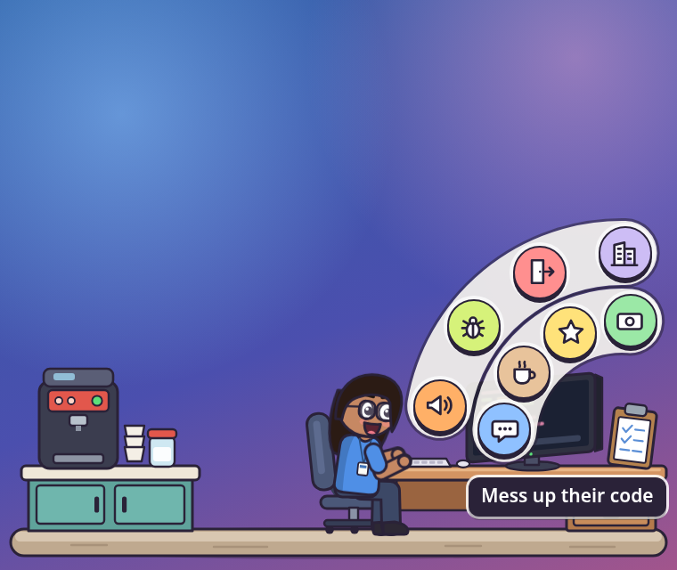
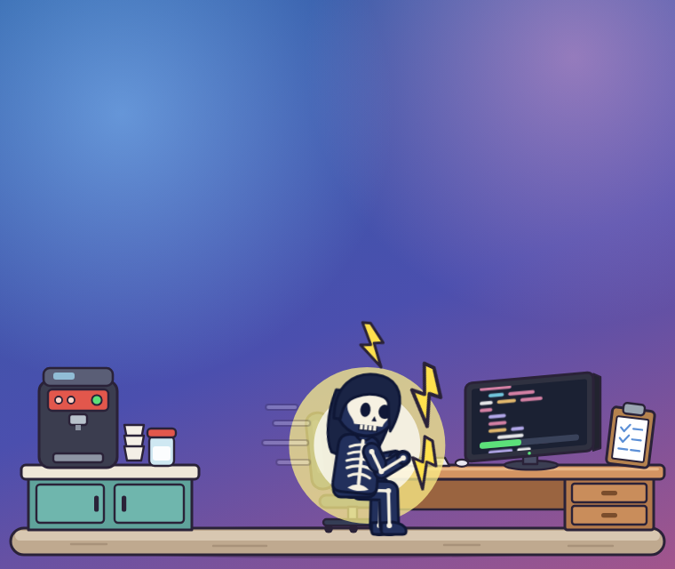
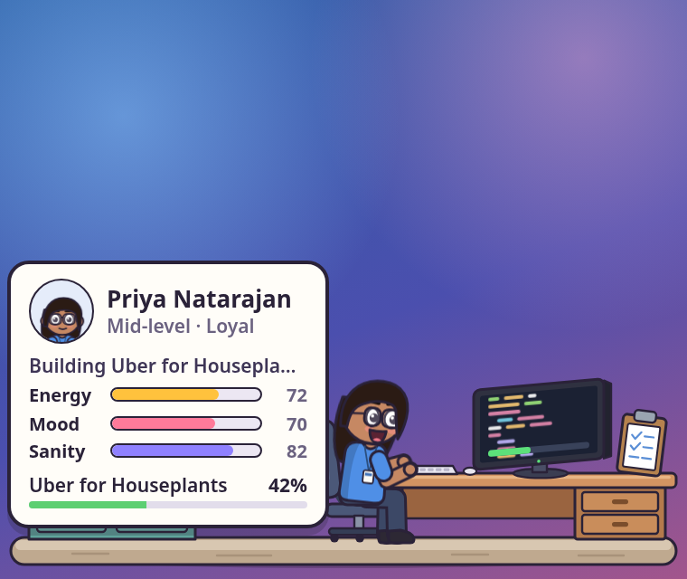
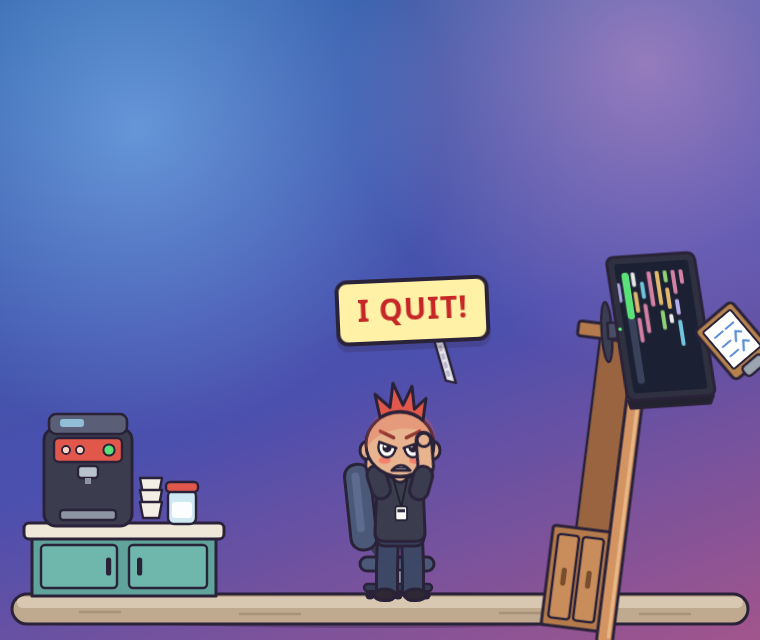
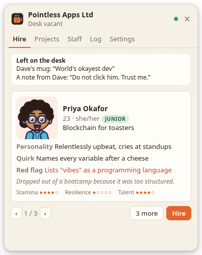
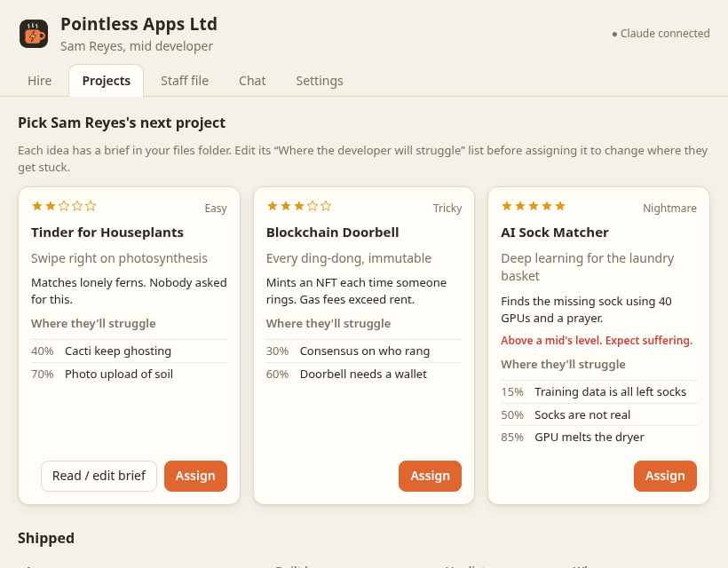

# Overtime

A tiny cartoon developer who lives in the bottom-right corner of your screen,
building apps nobody needs. Their brain is your Claude subscription. You're the
boss.

- **Click them** to give them an electric shock. They work faster, briefly. They
  remember.
- **The clipboard on their desk** opens the boss menu: chat, coffee, praise,
  shout, bonus (once a day), fire.
- **Pick their projects.** Every idea comes with a brief in
  `Documents/Overtime/pitches/` listing where the developer will struggle. Edit
  that list before assigning it and they'll struggle there instead. Give a junior
  a Nightmare project and watch what happens.
- **They break.** Lose their mind, get fried, rage-quit, or get fired. Then you
  hire someone new, and they find the last one's mug on the desk.

Close the app and they go home; time stops until you open it again.

| | |
|---|---|
|  |  |
|  |  |
|  |  |

(The purple wallpaper is only for screenshots; on your desktop the scene floats
over whatever is behind it.)

## What you need

- Windows 10/11 or macOS.
- [Claude Code](https://claude.com/claude-code) installed and logged in
  (`claude` in a terminal should work). Overtime calls it in print mode with the
  cheapest model (Haiku), tools off, so it runs on your subscription without an
  API key. Each line your worker says is one small call (~1,000 tokens in, ~50 out);
  expect a few dozen calls over a working day.

## Run it from source

```bash
npm install
npm start
```

It appears in the system tray (Windows) or menu bar (macOS). Show or hide the
worker with **Ctrl+Alt+Shift+O** (**⌘⌥⇧O** on a Mac).

## Build an installer

```bash
npm run dist:win   # on Windows: release/Overtime Setup *.exe and a portable .exe
npm run dist:mac   # on a Mac: release/Overtime-*.dmg
```

Or push the repo to GitHub and run the **build** workflow, which builds both.

The builds are unsigned. On macOS, the first time, right-click the app and choose
**Open** (or run `xattr -dr com.apple.quarantine /Applications/Overtime.app`). On
Windows, SmartScreen may ask you to confirm with **More info → Run anyway**.

## Screen sharing

- **Tray → Always on top** off lets them sink behind your windows.
- **Tray → Hide from screen share** keeps them visible to you but out of Teams
  and Zoom shares. This works on Windows 10 2004+; some macOS sharing tools ignore
  it, so hide them with the shortcut if in doubt.

## Where things live

| What | Where |
|---|---|
| Save file | `%APPDATA%\Overtime\save.json` / `~/Library/Application Support/Overtime/save.json` |
| Briefs and release notes | `Documents/Overtime/` (change it in Settings) |
| Design | [docs/design.md](docs/design.md) |

Delete the save file to start over completely.

## Development

```bash
npm test            # unit tests (simulation, brain parsing, briefs)
npm run typecheck
OVERTIME_SMOKE=1 npx vitest run tests/brain.smoke.test.ts   # real Haiku calls
node scripts/preview-overlay.mjs <out-dir>                    # screenshot every overlay state
npm run icons       # re-render the icons in assets/
```

| Path | Job |
|---|---|
| `src/game/` | Pure simulation: stats, projects, endings |
| `src/brain/` | Calls the Claude CLI; prompts, parsing, offline fallbacks |
| `src/files/` | Project briefs and release notes |
| `src/main/` | Electron: windows, tray, game loop, save |
| `src/renderer/overlay/` | The corner scene |
| `src/renderer/office/` | The office window |
